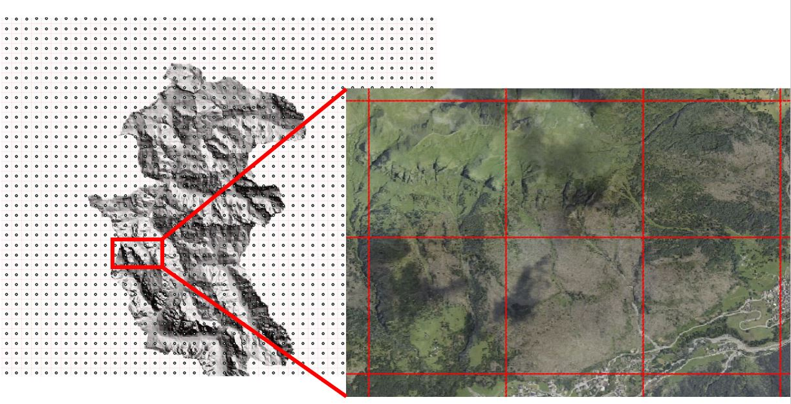

```{r setup, include=FALSE}
knitr::opts_chunk$set(echo = T, message=FALSE, warning = F )

```


# Code & Copyleft

```{r, message=FALSE, echo=FALSE}
source("copyright.R")
shiny::HTML(copyright)
```
 

\newpage

# Agenda

- From a regular lattice of points create squares
- In each square assign values from aggregating data (e.g. height above sea level of Earth surface)


&nbsp;

# R CRAN

## Starters   

We use RStudio IDE.  Create a .R file (ours is called *webinar1_2020_07_29.R*) and write the following lines of code. Ctrl-Return to run the line that cursor is on or run all highlighted lines. Or use the button in top right part of the editor.  

To add functionalities to your .R script you must load the specific libraries.  **REMEMBER:** make sure that they are installed in your system. If  not you can install through RStudio on **menu => Tools => Install Packages** or directly through R console with command   `install.packages("NAME OF PACKAGE") `
   

Below we add three libraries which add functionalities that we need  
```{r message=FALSE }
library(sf)
library(mapview)
library(raster)
```

&nbsp;

## Coordinate Reference System

My custom Coordinate Reference System (CRS) projection, Lambert Conical Conformal (LCC), NOT secant but tangent at lat=45.827 and lon=11.625 - for more info:   

- [PROJ library ](https://proj.org/operations/projections/lcc.html)   
- [Wikipedia](https://en.wikipedia.org/wiki/Lambert_conformal_conic_projection)   
- [Wolfram Mathworld](http://mathworld.wolfram.com/LambertConformalConicProjection.html)    
- [John P. Snyder “Map projections: A working manual” (pp. 104-110)](https://pubs.er.usgs.gov/publication/pp1395)   

```{r}
myproj <- "+proj=lcc +lat_1=45.827  +lat_2=45.827  +lat_0=45.827 +lon_0=11.625 +x_0=4000000 +y_0=2800000 +ellps=GRS80 +towgs84=0,0,0,0,0,0,0 +units=m +no_defs"
```

&nbsp;  
&nbsp;  

## Read lattice

My points (in lat long) over the regular grid/lattice these points are 666.67 m apart
```{r}
grid.points <- st_read( "data/webinar1_2020_07_29/points.shp" )
```

&nbsp;  


&nbsp;  

## Transform CRS

Convert my points from a Geographic (latitude and longitude degrees) to my custom CRS projection  
```{r}
grid.points.myproj <-   grid.points %>% st_transform(myproj)
```


&nbsp;  

&nbsp;  

## View in webmap

Run this line to view the points   
```{r}
  mapview( grid.points.myproj, legend = F  )
```


&nbsp;  

&nbsp;  

## Points to Squares

Points to a square Polygon areas. How? It is trivial, but faster way was to create a rhomboid with a certain distance from the point ("radius")  using a **buffer** of half the distance between points (333.33 m) .  The minimum bounding box of the buffer with that radius will be a square with sides  2x the size of the radius of the buffer.    

**NB:** nQuadSegs is 1 which means a chord(segment) at each quadrand, i.e. 1/4th of a circunference; this give a rhomboid which is a "very very rough circle" - it saves a lot of memory from drawing with a defaul value of *nQuadSegs=30* - it makes a difference when processing a large number of points.

We buffer each feature (point) and view results
```{r}
nodes.buffered<-st_buffer(grid.points.myproj, 333.33,  nQuadSegs = 1)
mapview( nodes.buffered, legend = F  )
```
&nbsp;  

&nbsp;  

Then we apply a function to each "rhomboid" for creating the square. It is a bit more complex as the function  includes another function inside.      

```{r}

st_bbox_by_feature = function(geom) {
  
  ## make sure that object "geom" becomes a geometry object;
  ## geom is your data set with all the single geometries/polygons
  geom2 = st_geometry(geom)
  
  #' Function to:
  #' (a) take a single geometry, 
  #' (b) create a bounding box with st_bbox and 
  #' (c) convert the bbox object to a new geometry (a square)
  f <- function(single.geom) { 
    st_as_sfc( st_bbox(single.geom,), crs=myproj)
  }
  
  #' This line calls the function above LOOPING over each single geometry (lapply)
  #'  in the geom2 object 
  do.call("c", lapply(geom2, f))
}
```


This line calls the above function over our data (rhomboids)   
```{r} 

tiles <- st_bbox_by_feature( nodes.buffered )
  
```

&nbsp;  

Assign the CRS to the new dataset as it got lost. To check the CRS of our data we can use  `{r} st_crs(tiles)`  
```{r}
tiles <- tiles %>% st_set_crs(myproj) 
```


&nbsp;  

We view all results all over the same map (small subset of data - the first 20 features).

PS you might notice a mis-alignment of the geometries, this is due to the webgis using a CRS called "earth universal transverse mercator" projection which as small deformations when representing data that is in other CRS.

For more reading see  [Wikipedia](https://en.wikipedia.org/wiki/Mercator_projection).

```{r}
mapview( grid.points.myproj[1:5,], legend = F ) + mapview( nodes.buffered[1:5,], legend = F  )  + mapview( tiles[1:5,], legend = F  )
```

&nbsp;  

## Save result

Convert to Latitude and Longitude and save result to shapefile for future upload to Google Earth Engine       
```{r eval=F }
tiles.latlng <- tiles %>% st_transform("+init=epsg:4326")
st_write(tiles.latlng, "data/tiles.shp" )
```
 

# GOOGLE EARTH ENGINE (GEE) 

Import shapefile files "tiles.XXX" by left panel "assets" and click "NEW" and choose shapefile from dropdown menu. 

**DO THINGS in GEE** 

 code shared: <a href="https://code.earthengine.google.com/?scriptPath=users%2F2020_Kanan%2Fsummer_webinar_series%3Awebinar1" target="_blank" >[click HERE to open your GEE code editor]</a> but also reported here below 
 
 
 
 
```{javascript }
// IMPORTS 
// these are in the "import" top part of the script editor in GEE, 
// but can also be added to the script itself.

var srtm = ee.Image("CGIAR/SRTM90_V4");

var  srtm_viz = {"opacity":1,"bands":["elevation"],
      "min":1439.9060309998727,"max":2892.700269813135,
      "palette":["005aff","ff0000"]}; 

var tiles = ee.FeatureCollection("users/2020_Kanan/summer_webinar_series/Webinar1_tiles");


////////////////////////////////////////////////////////////////////////////////////////////
///////////////// PART OF SUMMER WEBINAR SERIES 2020 /////////////////////////////////////// 
////////////////////////////////////////////////////////////////////////////////////////////
/////  Francesco Pirotti - CIRGEO / TESAF Department University of Padova //////////////////
////////////////////////////////////////////////////////////////////////////////////////////
/////  https://www.cirgeo.unipd.it/shared/R/webinars/webinar1_2020_07_29.html  /////////////
////////////////////////////////////////////////////////////////////////////////////////////
////////////////////////////////////////////////////////////////////////////////////////////

 

// "run" this script and then go to "tasks" button in the right panel to 
// run also the export of the data. 
// The last function in this script, "Export...", 
// will create a "task" that you have to launch manually 
// to put the final data  to your google drive


// this prints info on the "srtm" dataset that we imported 
print(srtm)
// PS double click in the link "SRTM Digital Elevation Data Version 4." above in the
// "imports" to see what data we are reading and aggregating at tiles 
///////////////////////////////////////////////////////////////////////////////////////

// this prints info on the "tiles" dataset that we imported from the 
// shapefile created with R
print(tiles);
///////////////////////////////////////////////////////////////////////////////////////

// this function below applies the "reduceRegions" function to the "srtm" dataset (image)
// over each feature (square polygon in our "tiles" dataset) ... 
// NB the "reducer" function applies 5 percentiles (10, 25, 50, 75, 90) thus allowing a good
// representation of distribution of height values inside the square. 
// We could also use average and standard deviation as reducers.
var  height =  srtm.reduceRegions({
  reducer: ee.Reducer.percentile([10,25,50,75,90]), 
  //reducer: ee.Reducer.mean(), 
  collection: tiles 
}); 

// this prints result
print(height);

// here we zoom to our tiles and add the layers
Map.centerObject(tiles, 12)
Map.addLayer(srtm, srtm_viz, "SRTM");
Map.addLayer(tiles, {}, "TILES");

// this exports the data to our Google drive
 Export.table.toDrive({
    collection: height,
    description:'tiles_withData',
    fileFormat: 'SHP'
  });


```

 
 
 
**EXPORT THE RESULTS TO A SHAPEFILE CALLED tiles_withData.shp**
  

Read the file exported from GEE   
```{r}
grid.points.gee <- st_read( "data/webinar1_2020_07_29/tiles_withData.shp" )
```


# R - Plot

## Calculate new IQR field

Create a new attribute column with the interquartile range (The difference between p75 and p25, i.e. 75<sup>th</sup> and 25<sup>th</sup> percentile)    
```{r}
grid.points.gee$iqr<-grid.points.gee$p75 - grid.points.gee$p25
```

\newpage

## PLOT variables

```{r}
pal = mapviewPalette("mapviewSpectralColors")
mapview( grid.points.gee, col.regions = pal(100), zcol = "p50", 
         color=NULL, alpha.regions=0.8  ) 
```
Figure 1 - 50th Percentile (median)  
  
\newpage
  
```{r}
mapview( grid.points.gee, col.regions = pal(100), zcol = "p10", 
         color=NULL, alpha.regions=0.8  ) 
```
Figure 2 - 10th Percentile


\newpage

```{r}
mapview( grid.points.gee, col.regions = pal(100), zcol = "iqr", 
         color=NULL, alpha.regions=0.8)
```
Figure 3 - Inter Quartile Range  

<br>
<br>

```{r}
sessionInfo()
```

